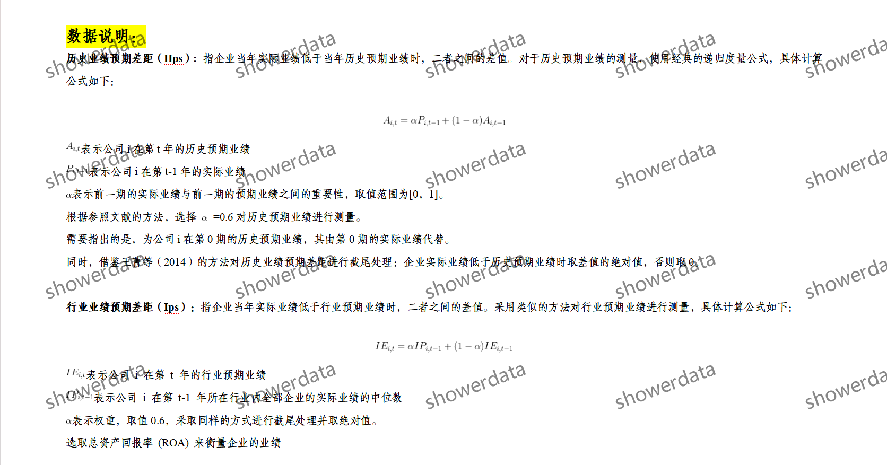
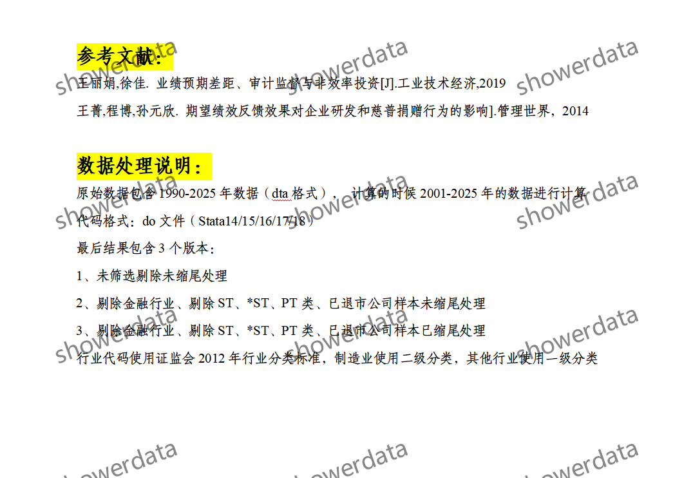
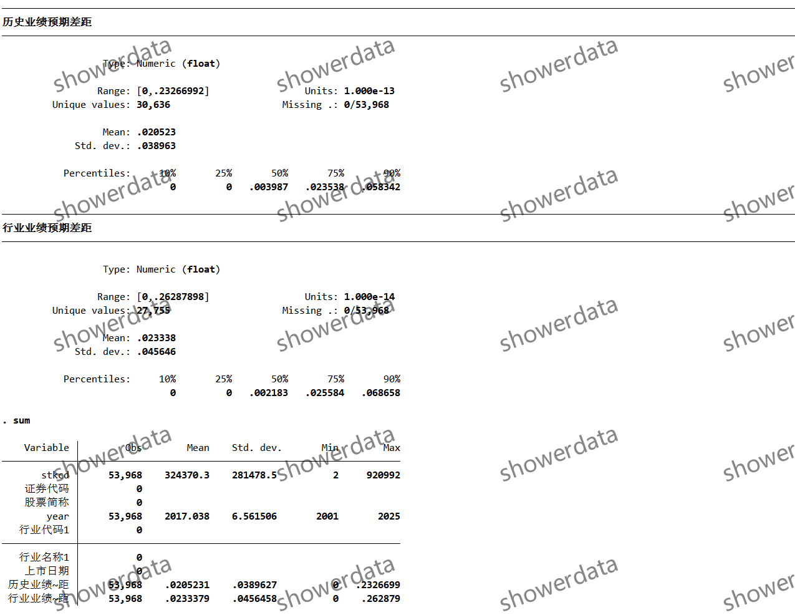
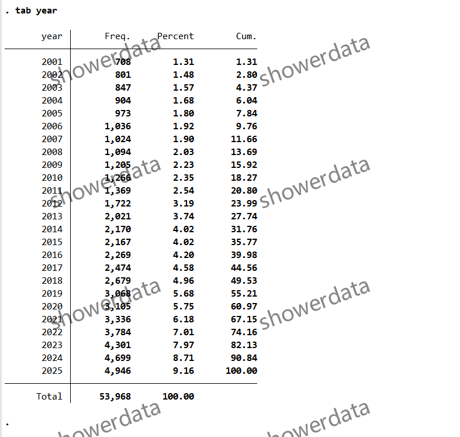
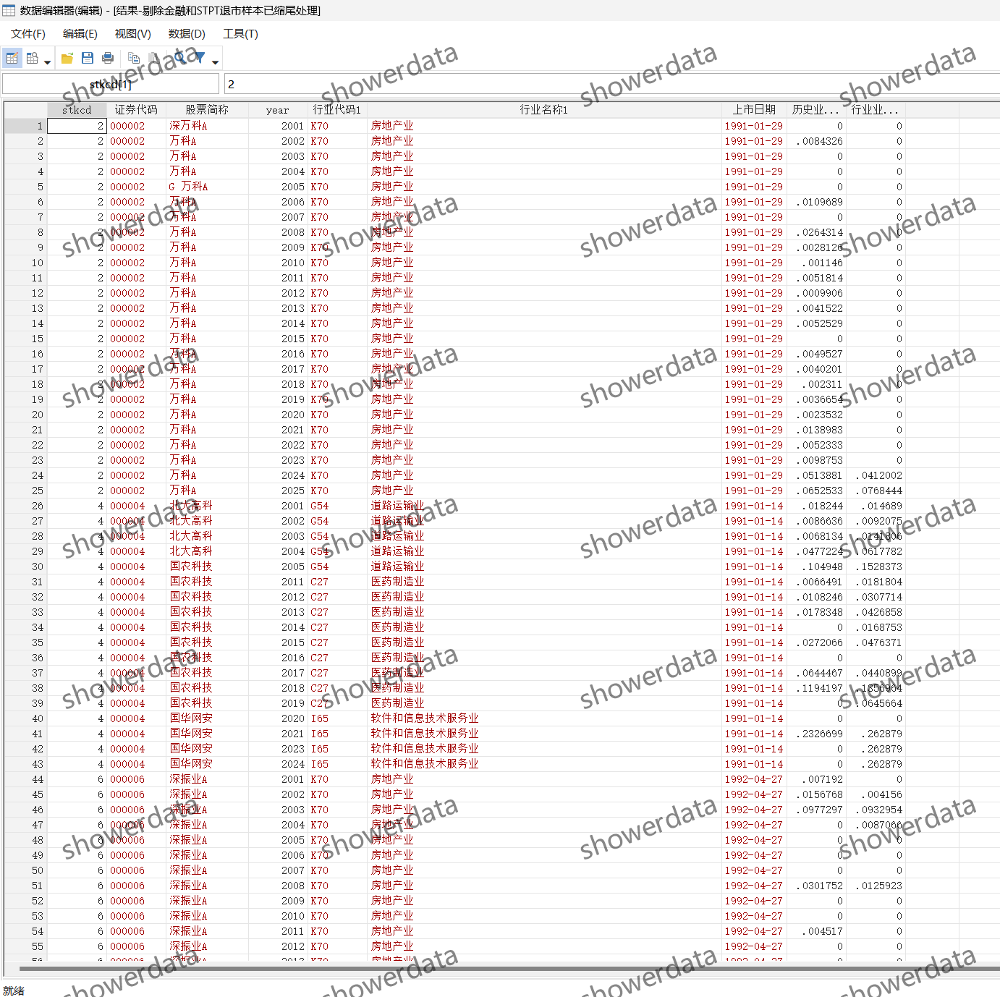
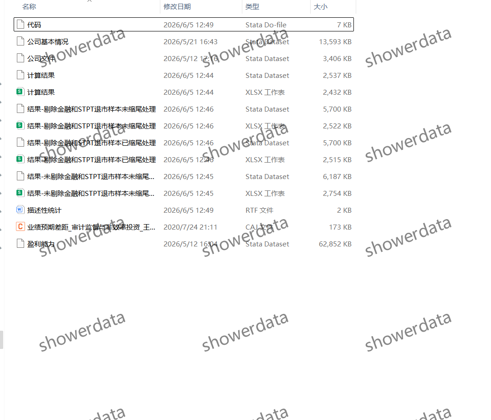

## Body

（2001-2025年）上市公司-历史业绩预期差距/行业业绩预期差距

拍后不支持无理由退款,可能会有缺失值，请看清楚再拍或者买前问清楚！展示结果为已剔除已缩尾

一、数据介绍
（1）数据详情：见下方图片，拍前请看清楚！已展示说明，请确定好是不是自己需要的再拍下！发货后任何理由不退不换！拍前请确认自己会使用再拍，不提供答疑，谢谢！数据可能会有客观原因所致缺失值，介意勿拍，谢谢！ 
（2）数据名称：上市公司-历史业绩预期差距/行业业绩预期差距
（3）样本范围：A鼓上柿公司
（4）时间范围：2001-2025年
（5）结果数据格式：excel、dta
（6）数据内容：结果、参考文献、原始数据、代码

二、数据结果指标如图所示

三、指标构造方法如图所示

四、参考文献如图所示

## Images

Here is a pay link on Stripe ( https://buy.stripe.com/3cs8yP7sY87d0vu9AB ). Please contact me lonlonago@foxmail.com after funding $89, and I will send you a complete data files , thank you!

